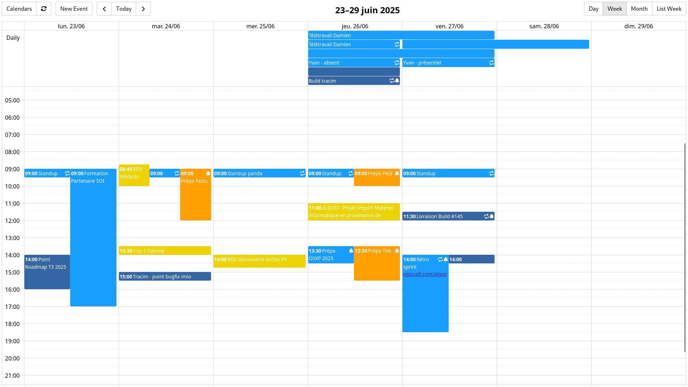

# Open Calendar

Open Calendar is a modern web calendar frontend for CalDAV based calendars.



### Key features
- [x] Configure individual calendars or multiple CalDAV servers
- [x] Display multiple calendars at the same time
- [x] Hide or show calendars and copy their URLs
- [x] Use the original calendar name and color
- [x] Show recurring events, alarms and attendees
- [x] Select timezones
- [x] Easily customize and integrate forms, notifications and rendering

### There are 3 ways to use it
1. [With just a few lines of code](#minimal-setup), you can get a ready-to-use CalDAV client web application
2. [With a bit of development](#customized-forms), you can integrate it into your web application by customizing the forms
3. [With a bit more work](#complete-integration), you can even customize all components like event rendering, notifications, etc

## Features

### Supports multiple calendars at the same time
Open Calendar can deal with many CalDAV calendars at once, and also discover calendars directly from CalDAV servers.

### Functional out of the box
Open Calendar supports all the features you would expect from a calendar client with little to no configuration: hide or show calendars or copy their URLs; drag, drop and resize events; show recurring events, alarms, attendees and more.

### Easily customizable
Open Calendar is built to be customizable and integrated into larger apps.
Events content, forms, dropdowns and even notifications can be replaced by custom ones with ease

<!-- TODO - CJ - 2025-07-09
### Well documented
Documentation for the API as well as examples can be found **Insert documentation link**
-->


## Quick start

First, install Open Calendar with the package manager of your choice (`yarn` in this case):
```bash
yarn add open-dav-calendar
```

Once this is done, you can add Open Calendar to your application at different levels:

> # 🚧 Bellow is a work in progress 🚧

### Minimal setup
With just a few lines of code, you can get a ready-to-use CalDAV client web application. All you need to do install `open-dav-calendar` and `tsdav` (for [auth functions](https://tsdav.vercel.app/docs/helpers/authHelpers)) and call `createCalendar`:
```ts
import { createCalendar } from "open-dav-calendar";
// You can install `tsdav` to access a variety of auth functions (https://tsdav.vercel.app/docs/helpers/authHelpers)
import { getBasicAuthHeaders } from "tsdav";

const serverUrl = window.prompt("server url")
const username = window.prompt("username")
const password = window.prompt("password")
createCalendar(
    [{ serverUrl: serverUrl, headers: getBasicAuthHeaders({ username, password }) }],
    document.getElementById("open-calendar"),
)
```
<!-- TODO - CJ - 2025-07-09
The full example is available **Insert demo module link**
-->

### Customized forms
With a bit of development, you can integrate it into your web application by customizing the forms
<!-- TODO - CJ - 2025-07-09
```ts
// Insert form ts code
```
The full example is available **Insert demo module link**
-->

### Complete integration
With a bit more work, you can even customize all components like event rendering, notifications, etc
<!-- TODO - CJ - 2025-07-09
```ts
// Insert eventBody ts code
```
The full example is available **Insert demo module link**
-->

## Architecture & development

Open Calendar is a TypeScript application relying on 3 main components:
- a Calendar rendering component: [EventCalendar](https://github.com/vkurko/calendar)
- a CalDAV client library: [tsdav](https://github.com/natelindev/tsdav)
- an ICS library: [ts-ics](https://github.com/Neuvernetzung/ts-ics)


## Need support, maintenance or features development?

Contact us at contact@algoo.fr
